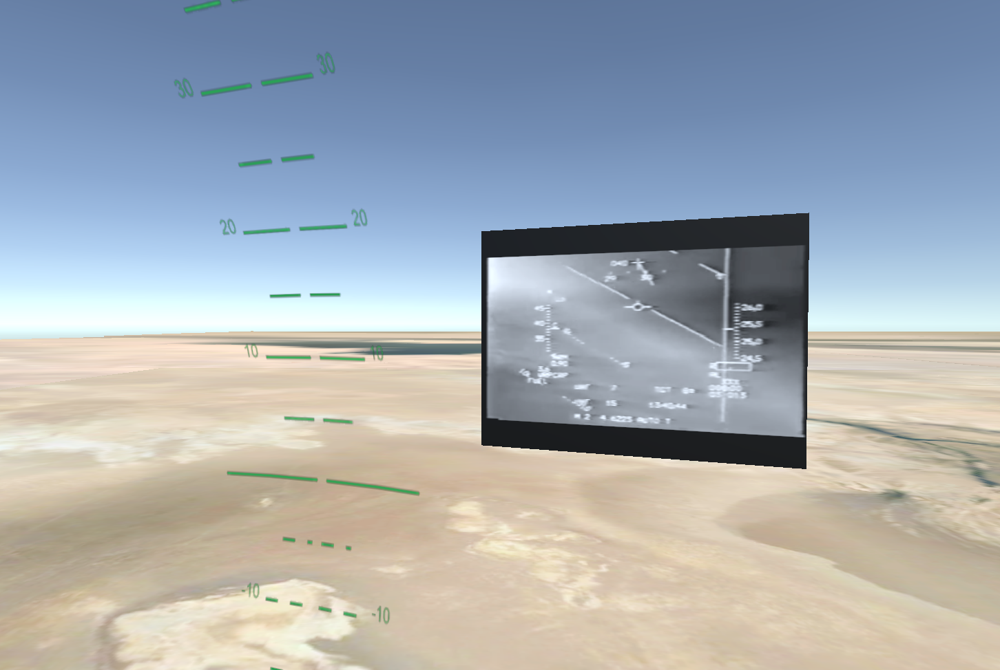

# F16 Attitude Logger

This Unity project was created in order to log the attitude of the F16 which dodged 6 SAMs (Surface-to-air missiles) near Baghdad on 19th January 1991.

## Reference

Details of this airstrike: [Package Q Strike | Wikipedia](https://en.wikipedia.org/wiki/Package_Q_Strike)

Head Up Display Footage: [F-16 dodging 6 Iraqi SAM launches on Jan 19 1991 | YouTube](https://www.youtube.com/watch?v=2uh4yMAx2UA)

Head Up Display Footage Breakdown: [F-16 Evades SIX Surface to Air Missiles! HUD Footage Breakdown](https://www.youtube.com/watch?v=TJE5gDDnq9s)
