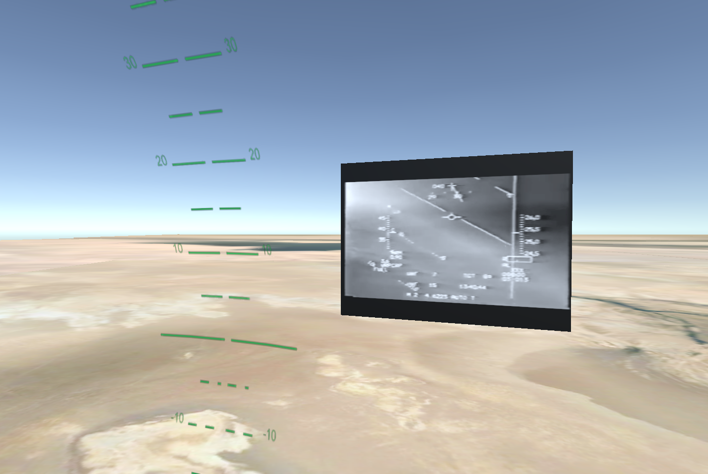
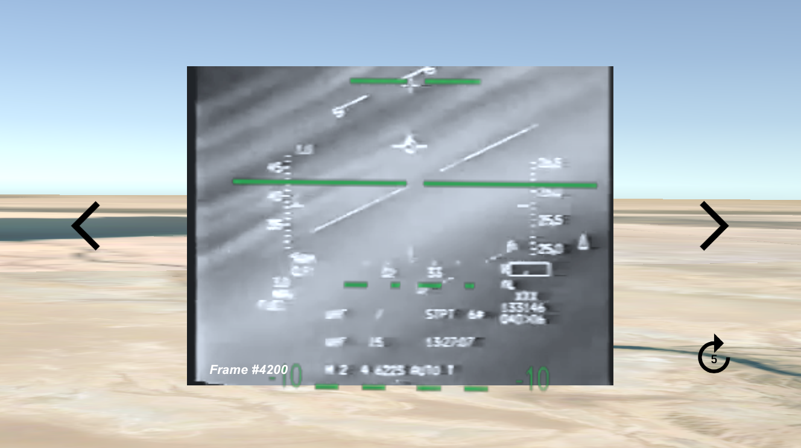
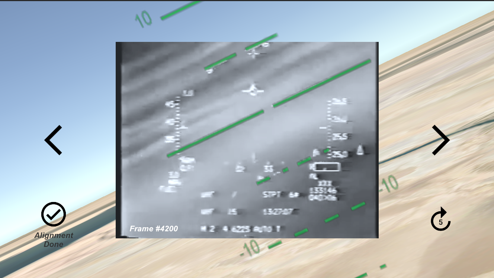

# F16 Attitude Logger for Package Q Strike Footage

This Unity project was created in order to log the attitude of the F16 which dodged 6 SAMs (Surface-to-air missiles) near Baghdad on 19th January 1991.

By connecting your iPhone with unity remote installed, you can control your main camera's attitude based on your iPhone's gyroscope. And by aligning the attitude indicator to that in the movie, you can track the actual F16's attitude.

## Reference

### Package Q Strike Footage

- [F-16 dodging 6 Iraqi SAM launches on Jan 19 1991](https://www.youtube.com/watch?v=2uh4yMAx2UA)

### Details of this airstrike

- [Package Q Strike](https://en.wikipedia.org/wiki/Package_Q_Strike)

### Head Up Display Footage Breakdown

- [F-16 Evades SIX Surface to Air Missiles! HUD Footage Breakdown](https://www.youtube.com/watch?v=TJE5gDDnq9s)
- [Package Q, Stroke 3 (Gulf War) | DCS World Reenactment](https://www.youtube.com/watch?v=mbj6BMRutYM)
- [DCS: F-16C Viper Early Access Guide | Digital Combat Simulator](https://www.digitalcombatsimulator.com/upload/iblock/aec/DCS_F-16C-Early_Access_Guide_EN.pdf)

## Alignment Images

Alignment of attitude indicator is done by hands with iPhone's gyroscope. When aligned, touch the video screen and the attitude data is written to the file.

